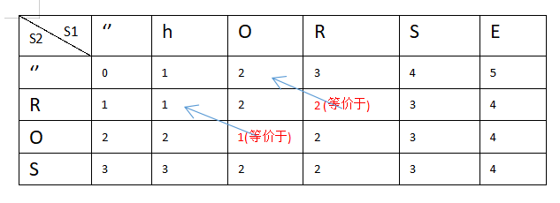
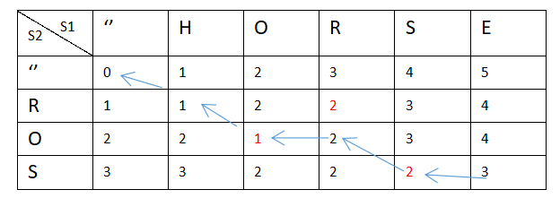

## 题目分析

题目：给你两个单词  word1 和  word2，请你计算出将  word1  转换成  word2 所使用的最少操作数  。

分析：

你可以对一个单词进行如下三种操作：

1. 插入一个字符
2. 删除一个字符
3. 替换一个字符

例子：

1. 输入：word1 = "horse", word2 = "ros"
2. 输出：3
3. 解释：

- horse -> rorse (将 'h' 替换为 'r')
- rorse -> rose (删除 'r')
- rose -> ros (删除 'e')

要点：

1. 对于字符串的动态规划问题，定义两个指针 i,j 分别从末尾开始
2. base case
3. 分类讨论，三个操作，插入，删除，替换，求最小值

## 方法 1：递归

> 数据量大运行超时

代码：

```javascript
/**
 * @param {string} word1
 * @param {string} word2
 * @return {number}
 */
var minDistance = function (word1, word2) {
  // horse  =>  ros
  //     i
  //   ros
  //     j

  //base case:
  //1. i === 0 && j === 0 isequal?0:1
  //2. i < 0 return j + 1;//插入
  //3. j < 0 reutrn i + 1;//删除

  //容易得出 s[i] === s[j] 不需要编辑，skip跳过 i--,j--, 等价于 求s[0,i-1] s[0,j-1]的编辑距离
  // 次数 = minDistance (s[0,i-1],s[0,j-1])
  //s[i] != s[j]
  //分类讨论，其实就是计算每种操作，然后取最小距离
  //插入： 次数 = minDistance(s[0,i],s[0,j-1]) + 1

  //删除： 次数 = minDistance(s[0,i-1],s[0,j]) + 1

  //替换： 次数 = minDistance(s[0,i-1],s[0,j-1]) + 1

  //综上 当s[i] != s[j]的时候 次数= Min(minDistance(s[0,i],s[0,j-1]) + 1,minDistance(s[0,i-1],s[0,j]) + 1, minDistance(s[0,i-1],s[0,j-1]) + 1)

  //结束条件： 即是上面的base case

  //上面是自顶向下的递归思路，实现代码如下
  const helper = function (i, j) {
    if (i < 0) return j + 1
    if (j < 0) return i + 1
    if (word1[i] === word2[j]) {
      return helper(--i, --j)
    } else {
      return (
        Math.min(helper(i, j - 1), helper(i - 1, j), helper(i - 1, j - 1)) + 1
      )
    }
  }
  return helper(word1.length - 1, word2.length - 1)
}
```

## 方法 2：递归优化-备忘录

> 优化后基本大大优化了执行时间

代码：

```javascript
var minDistance = function (word1, word2) {
  let hashMap = new Map()
  const helper = function (i, j) {
    let key = `${i}-${j}`
    if (hashMap.has(key)) {
      return hashMap.get(key)
    }
    if (i < 0) return j + 1
    if (j < 0) return i + 1
    if (word1[i] === word2[j]) {
      let ret = helper(--i, --j)
      hashMap.set(key, ret)
      return ret
    } else {
      let ret =
        Math.min(helper(i, j - 1), helper(i - 1, j), helper(i - 1, j - 1)) + 1
      hashMap.set(key, ret)
      return ret
    }
  }
  return helper(word1.length - 1, word2.length - 1)
}
```

## 方法 3：动态规划

> 自底向上 dp table,dp table 还可以记录最优的操作路径

例子： horse => ros dp table 表格：



代码：

```javascript
let m = word1.length,
  n = word2.length
let dp = new Array(n + 1)
//dp[i,j] 表示word1[0,i]字符转成word2[0,j]最小操作数
for (let i = 0; i < n + 1; i++) {
  dp[i] = new Array(m + 1)
}
//通过递归的分析，很容易得出状态转移方程
//dp[i][j] = w1[i] === w2[j] ? dp[i-1][j-1] : Math.min(dp[i,j-1],dp[i-1,j],dp[i-1,j-1]) + 1

//base case初始化
//为了好分析i,j < 0的情况，即加入空字符'',构建dp table
//比如horse => ros
//w1: '' 'h' 'o' 'r' 's' 'e'
//w2: '' 'r' 'o' 's'
for (let j = 0; j <= m; j++) {
  dp[0][j] = j
}
for (let i = 1; i <= n; i++) {
  dp[i][0] = i
}
for (let i = 1; i <= n; i++) {
  for (let j = 1; j <= m; j++) {
    //注意这里，i，j是从1开始，取char字符的时候的-1
    if (word2[i - 1] === word1[j - 1]) {
      dp[i][j] = dp[i - 1][j - 1]
    } else {
      dp[i][j] = Math.min(dp[i - 1][j - 1], dp[i][j - 1], dp[i - 1][j]) + 1
    }
  }
}
return dp[n][m]
```

## 方法 4：动态规划之优化空间复杂度

> 优化 O(min(m,n))的空间复杂度

代码：

```javascript
/**
 * @param {string} word1
 * @param {string} word2
 * @return {number}
 */
var minDistance = function (word1, word2) {
  let n = word2.length
  let dp = new Array(n + 1)
  for (let i = 0; i <= n; i++) {
    dp[i] = i
  }
  //由于只跟周围三个元素有关，这里得定义一个记录对角线那个值
  //储存二维数组下的dp[i-1][j-1]
  let last = 0
  for (let i = 1; i <= word1.length; i++) {
    last = dp[0]
    // dp[0] = dp[0] + 1;
    ++dp[0]
    for (let j = 1; j <= n; j++) {
      let temp = dp[j]
      if (word1[i - 1] === word2[j - 1]) {
        dp[j] = last
      } else {
        dp[j] = Math.min(dp[j], dp[j - 1], last) + 1
      }
      last = temp
    }
  }
  return dp[n]
}
```

## 扩展--动态规划之求操作路径

例子： horse => ros dp table 表格路径：



代码：

```javascript
function Node(val, choice = 0) {
  this.val = val
  this.choice = choice
  //0 代表啥都不能做
  //1 代表插入
  //2 代表删除
  //3 代表替换
}
var minDistancePath = function (word1, word2) {
  let m = word1.length,
    n = word2.length
  let dp = new Array(n + 1)
  for (let i = 0; i < n + 1; i++) {
    dp[i] = new Array(m + 1)
  }
  dp[0][0] = new Node(0)
  for (let j = 1; j <= m; j++) {
    //都是删除操作，choice为2
    dp[0][j] = new Node(j, 2)
  }
  for (let i = 1; i <= n; i++) {
    //插入操作，choice为1
    dp[i][0] = new Node(i, 1)
  }

  for (let i = 1; i <= n; i++) {
    for (let j = 1; j <= m; j++) {
      //注意这里，i，j是从1开始，取char字符的时候的-1
      if (word2[i - 1] === word1[j - 1]) {
        dp[i][j] = new Node(dp[i - 1][j - 1].val, 0)
      } else {
        let optArr = [
          {
            val: dp[i - 1][j - 1].val,
            choice: 3,
          },
          {
            val: dp[i][j - 1].val,
            choice: 2,
          },
          {
            val: dp[i - 1][j].val,
            choice: 1,
          },
        ]
        optArr.sort((v1, v2) => v1.val - v2.val)
        dp[i][j] = new Node(optArr[0].val + 1, optArr[0].choice)
      }
    }
  }
  let path = []
  //从最后开始遍历得出操作路径
  while (m != 0 && n != 0) {
    path.push(dp[n][m].choice)
    switch (dp[n][m].choice) {
      case 0:
      case 3:
        m--
        n--
        break
      case 1:
        n--
        break
      case 2:
        m--
        break
    }
  }
  return path //0跳过，3替换，1插入，2删除
}
```
