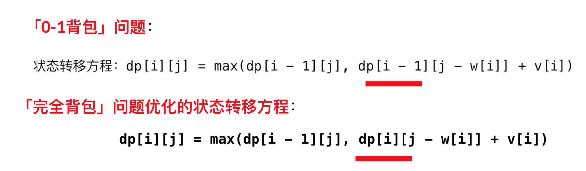

## 完全背包问题
有 NN件物品和一个容量是 VV 的背包。每件物品只能使用一次，每种物品都有无限件可用。第 ii 件物品的体积是 w_i ，价值是 v_i。求将哪些物品装入背包，可使这些物品的总体积不超过背包容量，且总价值最大。输出最大价值。

分析：「完全背包问题」的重点在于

每种物品都有无限件可用；
一个元素可以使用多个，且不计算顺序。
状态定义（和 「0-1 背包问题一样」）：dp[i][j] 表示考虑物品区间 [0, i] 里，不超过背包容量，能够获得的最大价值；

状态转移方程：
```
dp[i][j]=max(dp[i−1][j],dp[i−1][j−k×w[i]]+k×v[i])
```
这里 k >= 0 。

参考代码：
```java
import java.util.Scanner;

public class Solution {

    public static void main(String[] args) {
        Scanner scanner = new Scanner(System.in);

        // 读第 1 行
        int N = scanner.nextInt();
        int V = scanner.nextInt();

        // 读后面的体积和价值
        int[] weight = new int[N];
        int[] value = new int[N];

        for (int i = 0; i < N; i++) {
            weight[i] = scanner.nextInt();
            value[i] = scanner.nextInt();
        }


        // dp[i][j] 表示考虑物品区间 [0, i] 里，不超过背包容量，能够获得的最大价值；
        // 因为包含价值为 0 的计算，所以 + 1
        int[][] dp = new int[N][V + 1];
        // 先写第 1 行
        for (int k = 0; k * weight[0] <= V; k++) {
            dp[0][k * weight[0]] = k * value[0];
        }

        // 最朴素的做法
        for (int i = 1; i < N; i++) {
            for (int j = 0; j <= V; j++) {
                // 多一个 for 循环，枚举下标为 i 的物品可以选的个数
                for (int k = 0; k * weight[i] <= j; k++) {
                    dp[i][j] = Math.max(dp[i][j], dp[i - 1][j - k * weight[i]] + k * value[i]);
                }
            }
        }
        // 输出
        System.out.println(dp[N - 1][V]);
    }
}

```

复杂度分析：

时间复杂度：O(NW^2)，这里 N 是背包价值数组的长度，W 是背包的容量；
空间复杂度：O(NW)。
说明：这一版代码的时间复杂度很高，使用了三重循环，有重复计算。

## 优化「状态转移方程」（重点）

注意：下面这部分内容可能有一些繁琐，如果阅读有困难建议读者在纸上手写推导。

状态定义：dp[i][j] = max(dp[i - 1][j - k · w[i]] + k · v[i])，这里 k >= 0。 ①

单独把 k = 0 拿出来，作为一个 max 的比较项。

dp[i][j] = max(dp[i - 1][j], dp[i - 1][j - k · w[i]] + k · v[i])，这里 k >= 1。 ②

而当 k >= 1 的时候，把 v[i] 单独拿出来。

max(dp[i - 1][j - k · w[i]] + k · v[i]) = v[i] + max(dp[i - 1][j - k · w[i]] + (k - 1) · v[i]) ③

将 ① 中左边的 j 用 j - w[k] 代入：

dp[i][j - w[i]] = max(dp[i - 1][j - w[i] - k · w[i]] + k · v[i])，这里 k >= 0。
= max(dp[i - 1][j - (k + 1)· w[i]] + k · v[i])，这里 k >= 0。
= max(dp[i - 1][j - k· w[i]] + (k - 1) · v[i])，这里 k >= 1。④

结合 ②、③ 和 ④，推出 dp[i][j] = max(dp[i - 1][j], dp[i][j - w[i]]) + v[i]。

## 比较「0-1 背包」与「完全背包」问题的状态转移方程（重点）

### 关键在于「填表顺序」。



区别只在红色标出来的地方：「0 - 1」背包参考上一行，「完全背包」参考当前行。所以优化空间的写法，在一维数组里，「0 - 1」背包 倒序填表，完全背包正序填表。

### 参考代码 2：使用优化的状态转移方程（二维数组）
```java
import java.util.Scanner;

public class Solution {

    public static void main(String[] args) {
        Scanner scanner = new Scanner(System.in);

        // 读第 1 行
        int N = scanner.nextInt();
        int V = scanner.nextInt();

        // 读后面的体积和价值
        int[] weight = new int[N];
        int[] value = new int[N];

        for (int i = 0; i < N; i++) {
            weight[i] = scanner.nextInt();
            value[i] = scanner.nextInt();
        }

        // dp[i][j] 表示考虑物品区间 [0, i] 里，不超过背包容量，能够获得的最大价值；
        // 因为包含价值为 0 的计算，所以 + 1
        int[][] dp = new int[N + 1][V + 1];
        // 优化
        for (int i = 1; i <= N; i++) {
            for (int j = 0; j <= V; j++) {
                // 至少是上一行抄下来
                dp[i][j] = dp[i - 1][j];
                if (weight[i - 1] <= j){
                    dp[i][j] = Math.max(dp[i][j], dp[i][j - weight[i - 1]] + value[i - 1]);
                }
            }
        }
        // 输出
        System.out.println(dp[N][V]);
    }
}
```
复杂度分析：

时间复杂度：O(NW)O(NW)，这里 NN 是背包价值数组的长度，WW 是背包的容量；
空间复杂度：O(NW)O(NW)。

###  参考代码 3：使用优化的状态转移方程 + 优化空间（一维数组）

```java
import java.util.Scanner;

public class Solution {

    public static void main(String[] args) {
        Scanner scanner = new Scanner(System.in);

        // 读第 1 行
        int N = scanner.nextInt();
        int V = scanner.nextInt();

        // 读后面的体积和价值
        int[] weight = new int[N];
        int[] value = new int[N];

        for (int i = 0; i < N; i++) {
            weight[i] = scanner.nextInt();
            value[i] = scanner.nextInt();
        }

        int[] dp = new int[V + 1];
        // 先写第 1 行

        // 优化空间
        for (int i = 1; i <= N; i++) {
            // 细节，j 从 weight[i - 1] 开始遍历
            for (int j = weight[i - 1]; j <= V; j++) {
                dp[j] = Math.max(dp[j], dp[j - weight[i - 1]] + value[i - 1]);
            }
        }
        // 输出
        System.out.println(dp[V]);
    }
}

```
