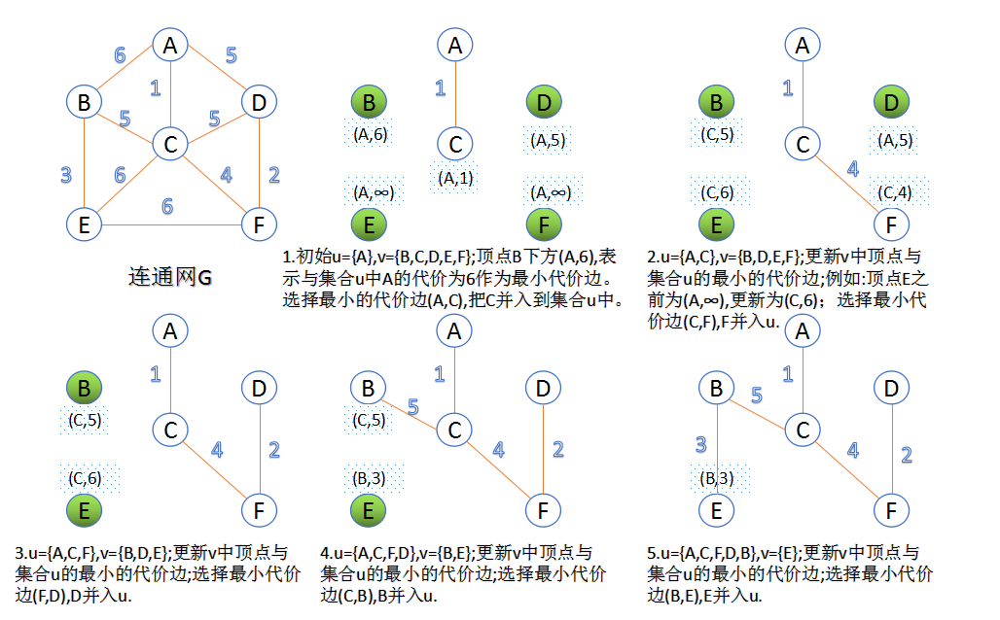

### 1. 图的概念

关于图的几个概念定义：

1. 连通图：在无向图中，若任意两个顶点 vi 与 vj 都有路径相通，则称该无向图为连通图。
2. 强连通图：在有向图中，若任意两个顶点 vi 与 vj 都有路径相通，则称该有向图为强连通图。
3. 连通网：在连通图中，若图的边具有一定的意义，每一条边都对应着一个数，称为权；权代表着连接连个顶点的代价，称这种连通图叫做连通网。
4. 生成树：一个连通图的生成树是指一个连通子图，它含有图中全部 n 个顶点，但只有足以构成一棵树的 n-1 条边。一颗有 n 个顶点的生成树有且仅有 n-1 条边，如果生成树中再添加一条边，则必定成环。
5. 最小生成树：在连通网的所有生成树中，所有边的代价和最小的生成树，称为最小生成树。

### 2. Kruskal 算法

> 此算法可以称为“加边法”，初始最小生成树边数为 0，每迭代一次就选择一条满足条件的最小代价边，加入到最小生成树的边集合里。


1. 把图中的所有边按代价从小到大排序；
2. 把图中的 n 个顶点看成独立的 n 棵树组成的森林；
3. 按权值从小到大选择边，所选的边连接的两个顶点 ui,viui,vi,应属于两颗不同的树，则成为最小生成树的一条边，并将这两颗树合并作为一颗树。
4. 重复(3),直到所有顶点都在一颗树内或者有 n-1 条边为止。

#### 算法流程

假设 N = (V,E) 是连通网，将 N 中的边按权值从小到大的顺序排列。

初始状态只有 n 个顶点而没有边的非连通图 T = (V，{})，图中每个顶点都自成一个连通分量；
在 E 中选择权值最小的边，若该边依附的顶点落在 T 中不同的连通分量上(不形成回路)，则将此边加入到 T 中，否则不添加而选择下一条权值最小的边；
重复步骤 2，直至 T 中的所有顶点都在同一连通分量上为止。

#### 结构设计

由于我们的视角放在“边”上，因此我们选择边集数组来存储图结构，为我们提取边的信息提供方便。同时为了判断是否形成回路，我们可能需要结合**_并查集_**来判断。

#### 算法步骤

首先将边集数组中的元素按权值从小到大排序。
接着依次检查边集数组的所有边，做如下操作：

从边集数组中选择一条边 (U1,U2);
在顶点数组中分别查找 v1 和 v2 所在的连通分量 vs1 和 vs2，进行判断。若 vs1 和 vs2 不相等，表明所选的两个顶点分别属于不同的连通分量，则合并连通分量 vs1 和 vs2。若相等，表明所选的两个顶点属于同一个连通分量属于同一个连通分量，舍弃这个边，选择下一条权值最小的边。

#### 代码

```js
// function find2(parent, index) {
// 	while (parent[index] !== index) {
// 		parent[index] = find2(parent,index);
// 	}
// 	return parent[index];
// }

// 并查集查看是否连通了
function find(parent, index) {
  while (parent[index] !== index) {
    index = parent[index]
  }
  return index
}
//抽象 边 对象
function Edge(b, e, w) {
  this.begin = b //边的起点
  this.end = e //边的终点
  this.wight = w //边的权值
}

//生成边集
function createGraph(G, n) {
  let array = []
  for (let i = 0; i < n; i++) {
    for (let j = i + 1; j < n; j++) {
      if (G[i][j] < Infinity) {
        let e = new Edge(i, j, G[i][j])
        array.push(e)
      }
    }
  }
  return array
}

function Kruskal(G) {
  let n = G.length
  let lists = createGraph(G, n)
  //排序
  lists.sort((v1, v2) => v1.wight - v2.wight)

  let path = []

  let parent = [] //存放最小生成树的顶点，利用图的并查集判断是否出现环了
  for (let i = 0; i < n; i++) {
    parent[i] = i
  }
  let result = 0
  for (let j = 0; j < lists.length; j++) {
    let { begin, end, wight } = lists[j]
    let p1 = find(parent, begin)
    let p2 = find(parent, end)
    //如果是两颗不同的树，则合并
    if (p1 !== p2) {
      //合并，这里都是并查集思路
      parent[p2] = p1
      result += wight
      console.log('打印：', begin, end, wight)
      path.push(begin + '-' + end)
    }
  }
  console.log(parent)

  console.log(result)
  return path
}

const Max = Infinity

const G = [
  [0, 1, 5, 2, Max, Max],
  [1, 0, 3, Max, 7, Max],
  [5, 3, 0, Max, Max, 6],
  [2, Max, Max, 0, Max, 8],
  [Max, 7, Max, Max, 0, 4],
  [Max, Max, 6, 8, 4, 0],
]

console.log(Kruskal(G))
```

### 3.Prim 算法

> 此算法可以称为“加点法”，每次迭代选择代价最小的边对应的点，加入到最小生成树中。算法从某一个顶点 s 开始，逐渐长大覆盖整个连通网的所有顶点。



1. 图的所有顶点集合为 V；初始令集合 u={s},v=V−u={s},v=V−u;
2. 在两个集合 u,vu,v 能够组成的边中，选择一条代价最小的边(u0,v0) ，加入到最小生成树中，并把 v0 并入到集合 u 中。
3. 重复上述步骤，直到最小生成树有 n-1 条边或者 n 个顶点为止。
4. 由于不断向集合 u 中加点，所以最小代价边必须同步更新；需要建立一个辅助数组 closedge,用来维护集合 v 中每个顶点与集合 u 中最小代价边信息

当我使用邻接矩阵来存储时，由于需要描述 U 到 V-U 具有最小权值的边，因此需要两个数组来辅助：

1. lowcost 数组：存储最小边上的权值；
2. adjvex 数组：存贮最小边在 U 中的顶点。

> 可以利用堆排序优化取最小定点索引值

```js
邻接矩阵表示：
const G = [[-1,1,5,2,∞,∞],
 [1,-1,3,∞,7,∞],
 [5,3,-1,∞,∞,6],
 [2,∞,∞,-1,∞,8],
 [∞,7,∞,∞,-1,4],
 [∞,∞,6,8,4,-1]]
const n = 6
```

#### 代码如下

```js
/**
 * 最小生成树，加点法prim算法
 * @param {number[][]} matrix 邻接矩阵
 * @param {number} n
 */
function prim(matrix, n) {
  let min
  let adjvex = [] //保存相关顶点下标
  let lowcost = new Array(n) //保存相关顶点间边的权值
  let result = 0 //权重

  //默认选择第一个点开始
  adjvex[0] = [0]
  lowcost[0] = 0

  for (let i = 1; i < n; i++) {
    lowcost[i] = matrix[0][i]
  }
  console.log(lowcost)

  for (let i = 1; i < n; i++) {
    min = Infinity
    //查找lowcost里面的最小值，除了0之外的，因为0这里标记为已选了的点
    let j = 1,
      minIndex = 0
    while (j < n) {
      if (lowcost[j] !== 0 && lowcost[j] < min) {
        min = lowcost[j]
        minIndex = j
      }
      j++
    }

    //找到了minIndex最小，加入到树里面
    lowcost[minIndex] = 0

    if (minIndex !== 0) {
      adjvex.push(minIndex)
      result += min
    }

    //加入新的点后，更新lowcost对应的边最小权重值
    for (let i = 1; i < n; i++) {
      if (lowcost[i] !== 0 && matrix[minIndex][i] < lowcost[i]) {
        lowcost[i] = matrix[minIndex][i] //更新为最小值
      }
    }
  }

  console.log(result, adjvex)

  return result
}

const Max = Infinity
const G = [
  [0, 1, 5, 2, Max, Max],
  [1, 0, 3, Max, 7, Max],
  [5, 3, 0, Max, Max, 6],
  [2, Max, Max, 0, Max, 8],
  [Max, 7, Max, Max, 0, 4],
  [Max, Max, 6, 8, 4, 0],
]

prim(G, G.length)
```
